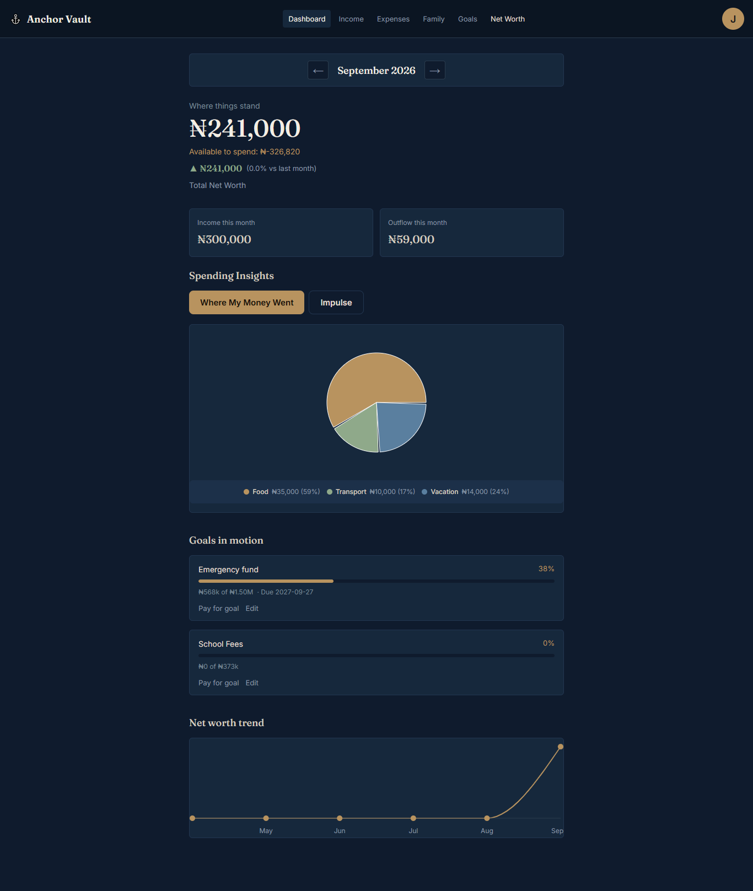
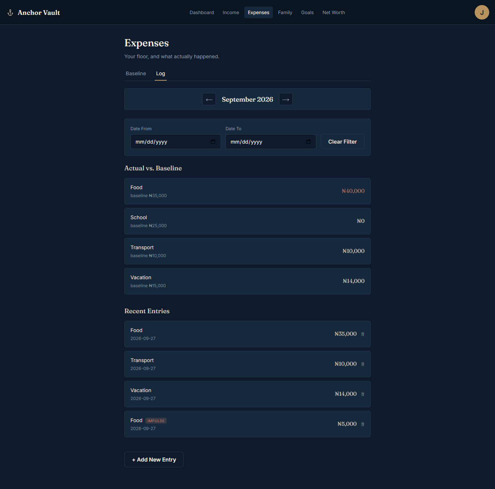
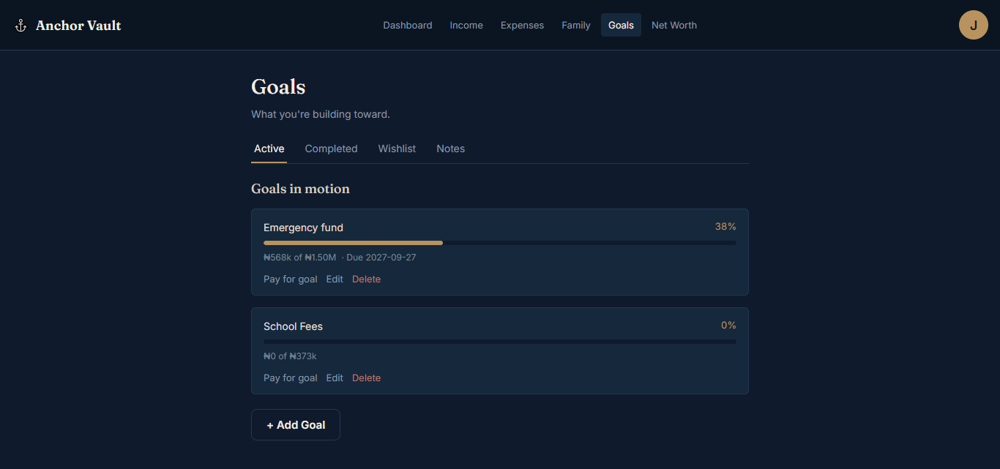
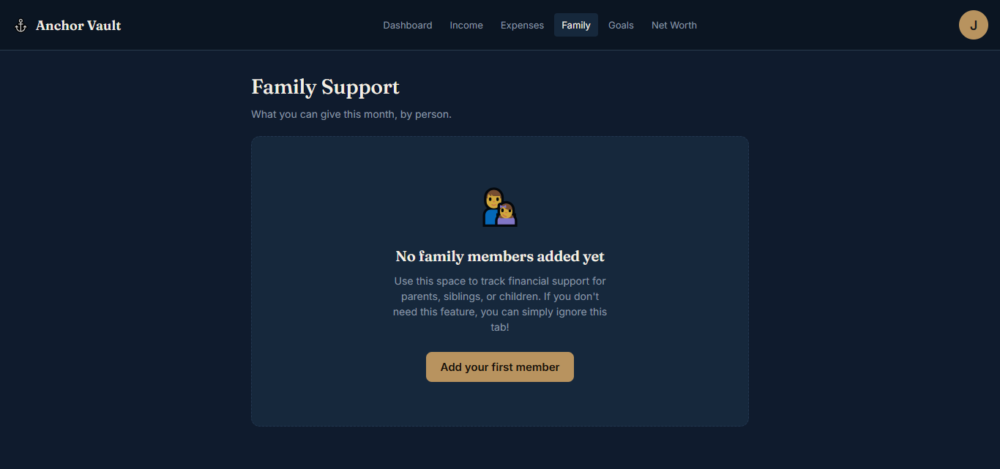

# ⚓ Anchor Vault

**Take control of your financial future. A mathematically sound, multi-currency personal finance and net worth tracker.**

Anchor Vault is a progressive web app (PWA) designed to give you absolute clarity over your financial health. Unlike traditional expense trackers that obscure your true net worth or double-count your funds, Anchor Vault treats your transaction history as the single source of truth, dynamically calculating your holdings across multiple currencies.

🚀 **[Start Tracking Your Net Worth for Free →](https://anchorvault.vercel.app)**

---

## ✨ Why Choose Anchor Vault?

### 💰 Multi-Currency Net Worth Engine
*   **Dual Currency Support:** Seamlessly track holdings in both NGN (₦) and USD ($).
*   **Live Conversion:** See real-time NGN equivalents instantly when logging USD transactions.
*   **Dynamic Net Worth:** `Total Net Worth = NGN Holdings + (USD Holdings × Exchange Rate)`.
*   **True Read-Only Holdings:** Your USD and NGN totals are strictly calculated from your actual transaction history—no manual, error-prone inputs.

### 📊 Comprehensive Financial Tracking
*   **Income:** Track dynamic income sources with multi-currency support. (Automatically excludes "Starting Balance" from monthly income charts while correctly adding it to your total Net Worth).
*   **Expenses:** Category-based tracking with baseline budgets, impulse buy tagging, and goal-funded payment tracking.
*   **Family Support:** Track financial support for family members with individual monthly budgets and instant overage warnings.
*   **Goals:** Set clear savings targets with visual progress tracking.
*   **Wishlist:** Aspirational tracking for future purchases without cluttering your active savings goals.

👉 **[Create Your Free Account Today](https://anchorvault.vercel.app)** and see your financial picture in minutes.

---

## 🛠️ Built With Modern Technology

*   **Frontend:** React, Vite
*   **Backend & Database:** Supabase (PostgreSQL, Auth, Row Level Security)
*   **Styling:** Custom CSS (Mobile-first, PWA-ready)
*   **Charts:** Recharts

---

## 🧠 Architectural Decisions

*This section is for the engineers, investors, and technical founders reviewing this project.*

### 1. Transactions as the Single Source of Truth
Instead of maintaining separate "balance" fields in the database that require complex, error-prone syncing, Anchor Vault calculates all balances on the fly from the `transactions` table. This prevents data drift and ensures that if a historical transaction is deleted, the net worth instantly and correctly recalculates.

### 2. The "Starting Balance" Pattern
To allow users to log their initial wealth without artificially inflating their "Income this month" charts, the app uses a reserved system source named `"Starting Balance"`. 
*   **Net Worth Engine:** Includes these transactions in total holdings.
*   **Monthly Summary Engine:** Explicitly filters out `tx.source === 'Starting Balance'` from monthly income calculations.

### 3. Dynamic Sources vs. Hardcoded Arrays
Early versions hardcoded income sources (e.g., `['Freelance', 'Salary']`). This was refactored to a dedicated `income_sources` database table. This ensures the app scales infinitely without requiring code deployments when a user starts a new side hustle.

### 4. Referential Integrity for Goal-Linked Transactions
Transactions tied to a savings goal (`goal_id`) are enforced with a foreign key back to the `goals` table (`ON DELETE SET NULL`). If a goal is deleted, its historical transactions are preserved — they simply become unlinked rather than disappearing or referencing a goal that no longer exists. This keeps financial history intact even as goals are created, completed, or removed.

---

## 📸 Screenshots

---

## 🗺️ Future Roadmap (v2)

*   **The Bucket System:** Advanced allocation of funds into specific buckets (e.g., Rent, Groceries, Vacation) rather than just broad categories.
*   **USD Expenses:** Allowing direct spending from USD holdings (currently USD is strictly a savings/holding currency).
*   **Offline-First PWA:** Implementing a Service Worker and IndexedDB for full offline transaction logging and background syncing.
*   **Investment Tracking:** Expanding the Net Worth engine to include non-cash assets.

---

## 👤 Author

*   **Jacey** - [Portfolio](https://jacey10.vercel.app/)

## 📄 License

All Rights Reserved. This project's source code is proprietary and is not licensed for reuse, modification, or redistribution.

---

### 🚀 Ready to build your wealth?
**[Join Anchor Vault Now](https://anchorvault.vercel.app)** and stop guessing where your money goes.